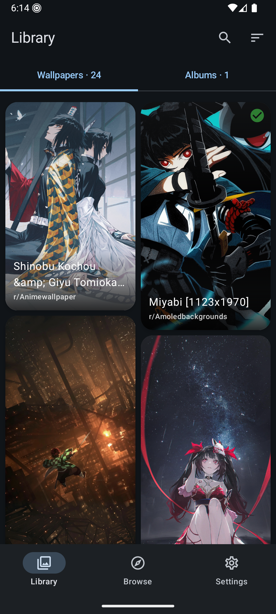

# WallBase

WallBase is an Android app for collecting, organizing, and backing up a personal wallpaper library.  
It fetches wallpapers from popular sources and lets you keep everything stored locally.

---

## Highlights
- **Browse Wallpapers**: Discover and save wallpapers from popular online sources.
- **Organize Locally**: Store your favorites into albums with customizable layouts and sorting options.
- **Simple Backup**: Export or restore your collection and settings in one package.

---

## Preview

---

## About
WallBase is built for wallpaper enthusiasts who want a fast, private, and offline-friendly way to enjoy, organize, and safeguard their wallpaper collection.