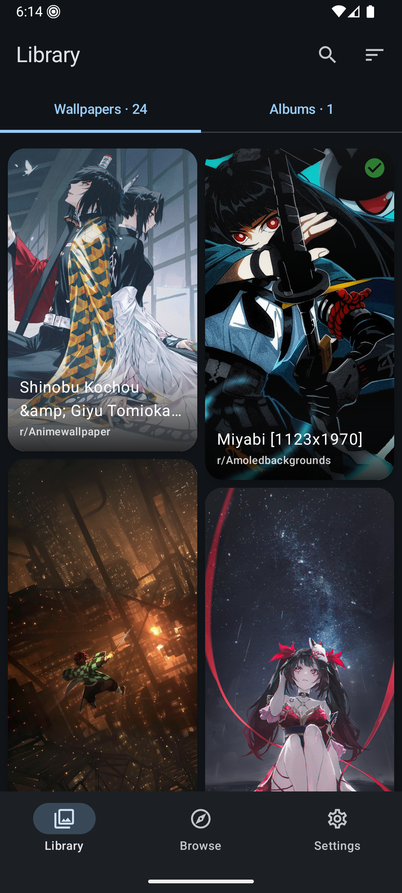

  
  <h1 style="border-bottom: none">WallBase</h1>
  
An Android app for collecting, organizing, and backing up a personal wallpaper library.
 

 

## Features

- **Browse & Discover**: Find and save wallpapers from various online sources.
- **Local Organization**: Create custom albums with different layouts and sorting options to manage your collection.
- **Simple Backup & Restore**: Easily export or import your entire library and settings with a single file.
- **Privacy-Focused**: Your collection is stored locally on your device.
 

  

 
---
