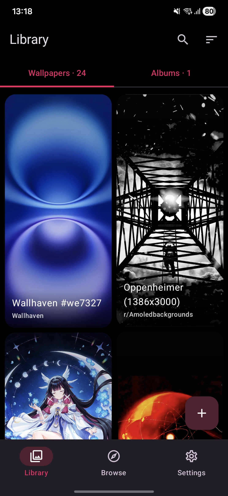
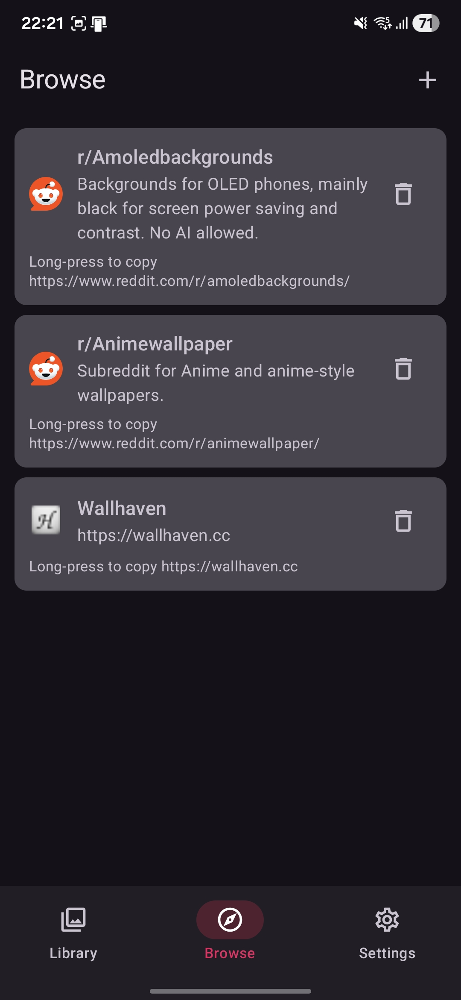
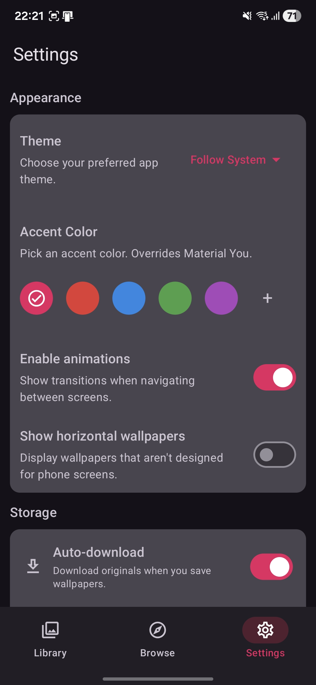

  

  <h1>WallBase</h1>
  
<strong>Elevate your Android aesthetic.</strong>

  
An open-source wallpaper discovery and management engine for the modern Android ecosystem. Find, save, and automate high-quality wallpapers from the web’s most curated sources.

   

---

## ✨ Features

- 🖼️ **Curated Sources:** Browse wallpapers from Reddit, Pinterest, Wallhaven, and more.
- 🎨 **Advanced Theming:** Switch between Light, Dark, and true **AMOLED Black** modes.
- 🌈 **Custom Accents:** Personalize your experience with a curated palette of UI accent colors.
- 🔄 **Auto-Refresh:** Keep your home screen fresh with automated wallpaper rotation.
- 🚀 **Modern Stack:** Built with **Jetpack Compose**, **Kotlin**, and **Material 3** for smooth performance.
- 🔒 **Privacy Focused:** Secure your library with integrated biometric authentication.

## 📱 Previews

  
  
  

## 🤝 Contributing

Contributions are welcome! Please open an issue or submit a pull request.

## 📄 License

This project is licensed under the MIT License. See the [LICENSE](LICENSE) file for details.
