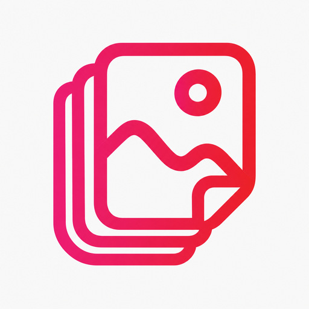
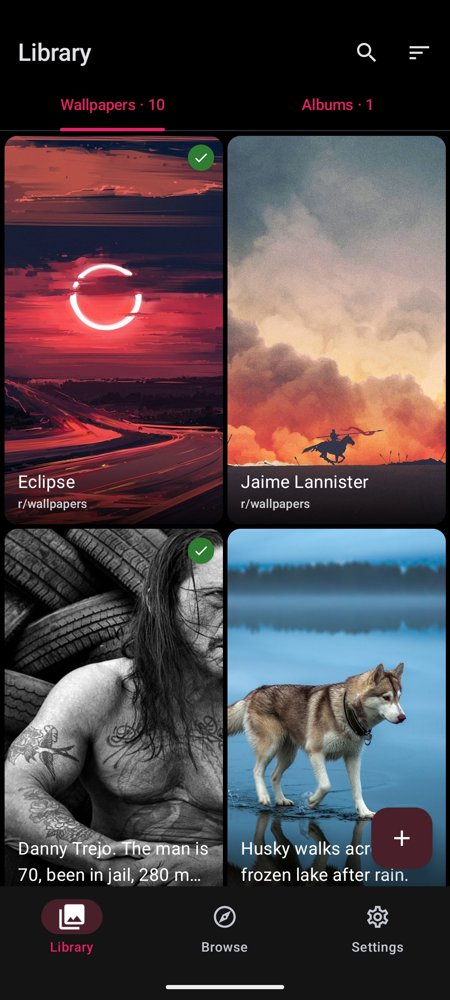
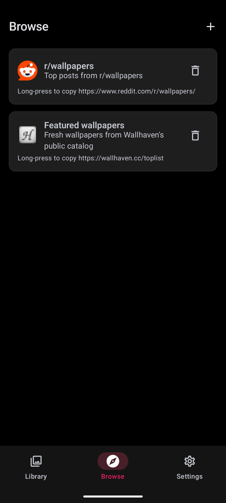
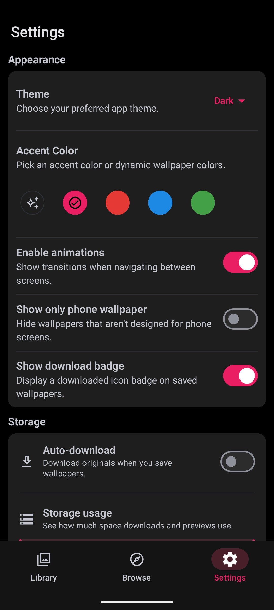

<div align="center">
  

  # WallBase

  **Elevate your Android aesthetic.**

  An open-source wallpaper discovery and management app for Android.  
  Find, organize, and personalize high-resolution wallpapers across curated online sources.

  <br/>

  [](https://opensource.org/licenses/MIT)
  [-3DDC84.svg?logo=android)](https://www.android.com)
  [](https://kotlinlang.org)
  [](https://developer.android.com/jetpack/compose)
  [](https://github.com/joshiminh/WallBase/releases)
</div>

---

## Screenshots

<div align="center">
  <table>
    <tr>
      <td align="center" width="33%"><b>Library & Collections</b></td>
      <td align="center" width="33%"><b>Source Discovery</b></td>
      <td align="center" width="33%"><b>Settings & Theming</b></td>
    </tr>
    <tr>
      <td align="center">
        
      </td>
      <td align="center">
        
      </td>
      <td align="center">
        
      </td>
    </tr>
  </table>
</div>

---

## Features

- **Multi-Source Discovery**: Search and browse high-resolution wallpapers from multiple platforms including Reddit, Wallhaven, and Pinterest.
- **Personal Library & Custom Albums**: Organize favorite wallpapers into custom collections with offline caching and direct downloads.
- **Material You & Custom Theming**: Support for dynamic theming, pure AMOLED dark mode, and customizable accent colors.
- **One-Tap Wallpaper Setup**: Set wallpapers directly to Home Screen, Lock Screen, or both, with integrated palette extraction.
- **Biometric Security**: Protect saved collections and private albums with integrated biometric authentication.
- **Modern Performance**: Smooth edge-to-edge layouts, asynchronous image decoding, and efficient memory management.

---

## Tech Stack & Architecture

WallBase is engineered following modern Android development practices and Clean Architecture principles:

- **UI Framework**: 100% Jetpack Compose with Material 3 (Material You)
- **Architecture**: MVVM with Unidirectional Data Flow (UDF) and StateFlow
- **Dependency Injection**: Dagger Hilt
- **Persistence**: Room Database (SQLite) and Jetpack DataStore Preferences
- **Networking**: Retrofit 2, Moshi, OkHttp 4, and Jsoup
- **Image Pipeline**: Coil 3 with OkHttp caching
- **Minimum SDK**: Android 8.0 (API level 26)
- **Target SDK**: Android 16 (API level 36)

---

## Building and Running

### Prerequisites

- **JDK 21** configured on your system
- **Android SDK** (Target SDK `36`, Minimum SDK `26`)
- **Android Studio** (Ladybug / Meerkat or newer) OR **Android CLI Tools / ADB**
- A connected **physical Android device** (USB Debugging enabled) or a running **Android Emulator** (API 26+)

### Running via Command Line (Terminal / PowerShell)

1. **Check connected devices / emulators:**
   ```bash
   adb devices
   ```

2. **Build and install the debug APK:**
   - **Windows (PowerShell/CMD):**
     ```pwsh
     .\gradlew installDebug
     ```
   - **macOS / Linux:**
     ```bash
     ./gradlew installDebug
     ```

3. **Launch the application:**
   ```bash
   adb shell am start -n com.joshiminh.wallbase/.MainActivity
   ```

### Running via Android Studio

1. Open the project root folder in **Android Studio**.
2. Let Gradle sync and index dependencies.
3. Select your connected target device or emulator.
4. Click the **Run** button (`▶` / `Shift + F10`).

### Configuration (Optional)

WallBase works **out-of-the-box without any extra configuration**. All sources work with public endpoints by default, and optional API keys (such as Wallhaven) can be configured directly inside the app's settings.

---

## Contributing

Contributions, bug reports, and feature suggestions are welcome. Please feel free to open an issue or submit a pull request.

1. Fork the repository
2. Create your feature branch (`git checkout -b feature/amazing-feature`)
3. Commit your changes (`git commit -m 'Add amazing feature'`)
4. Push to the branch (`git push origin feature/amazing-feature`)
5. Open a Pull Request

---

## License

This project is licensed under the MIT License. See the [LICENSE](LICENSE) file for details.
